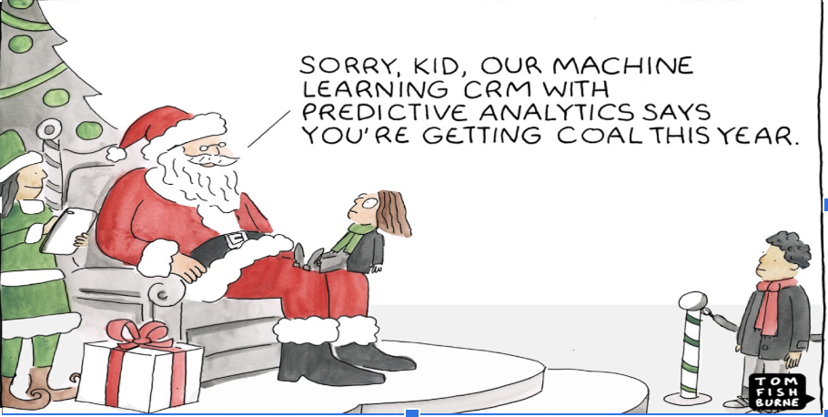
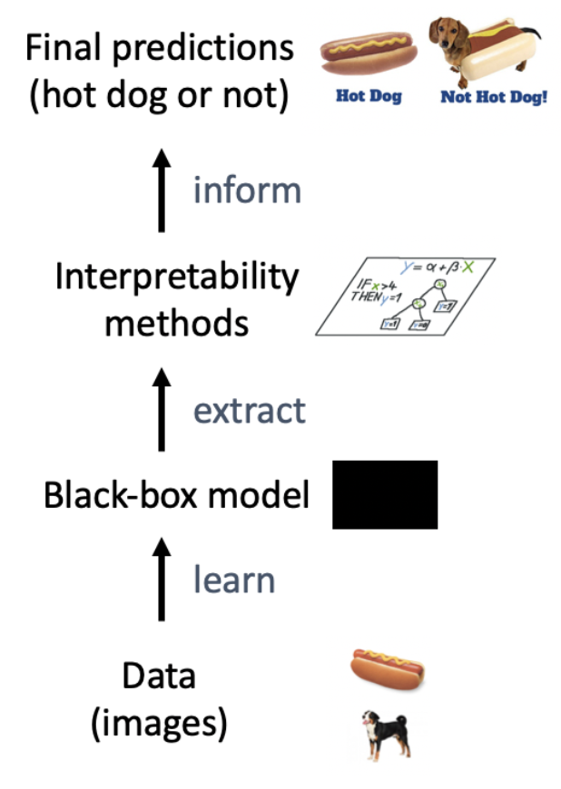
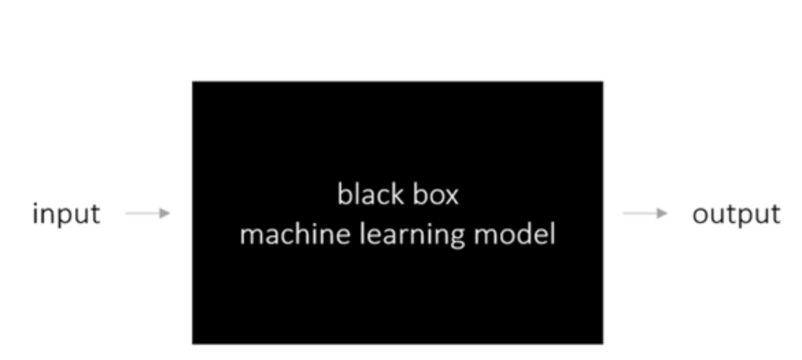
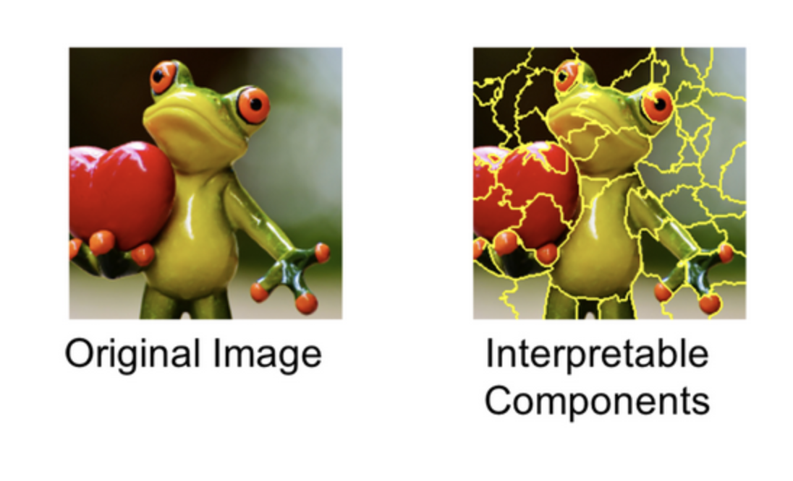
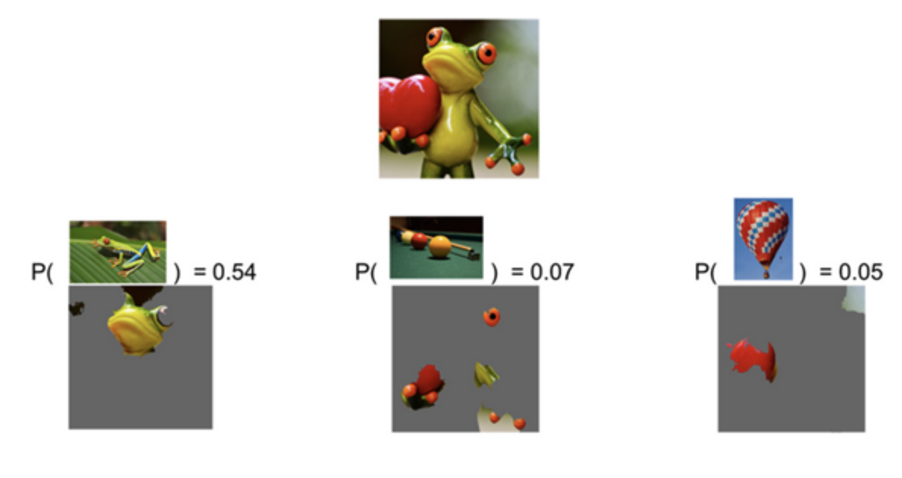

## Interpretability

 

Interpretability is a term every data scientist today should familiarize themselves with. This is because we need to know if we can rely on the results we get from using a machine learning model. In machine learning feeding a model data and training it to predict something for you is the process used today to get answers, and often impressive answers due to how powerful these models are. But that does not mean it can be trusted. 

When running a machine learning model, the model learns and gives you answers, for example in the form of classification. If the model you run gives you great answers, then why not just be happy with the results and ignore the process of how a conclusion was made? In order to know if we can trust the results or not, it is important to understand how the model has learned and why it made the decision it did.

 

This is where model interpretability comes in the picture. Model interpretability is how humans understand and learn how a machine learning model or artificial neuron network reaches the conclusions it does, what features are behind a decision. Therefore it is important for humans to understand how the model works and learns in order to trust the results it gives. 

For example, if you have a collection of pictures with either a dog or a moose and want to classify them with a machine learning model. The model is supposed to learn the features of the animals, but let’s say you took all the pictures of dogs in an indoor setting while all the moose was in the forest. Here you run the risk of the model classifying based on the surroundings of the animal instead of the features of it. So if you have a dog in the forest the picture would be classified as a moose. Therefore it is important to understand how a model reached the conclusions it did to give credibility to the results.

 

So hopefully, for Christmas, Santa won't trust his prediction if it says you are getting coal this year, while we all know you have been good.

## Model-Agnostic Interpretation Methods

Now let’s have a look at model-agnostic interpretation methods. It simply means the ability of the model to be applied to any black-box model that we have known so far and even for those models that may be developed in the future. In other words, the machine learning model and the explanations (or interpretation) are independent. 

Regarding model interpretation, there have been 2 main classifications. The first one is interpretable models we usually used in statistics such as linear regression, logistic regression, decision tree, the second one is what we call “black box models” which can be interpreted by model-agnostic interpretation methods or model-specific ones. Compared to interpretable models and model-specific interpretation methods, which tend to limit us to one type of model, the model-agnostic interpretation methods give us more freedom to play with any type of machine learning model and change stuff if we want.

Let's have a more intuitive understanding about model-agnostic interpretability, which is a layer able to be put on top of any machine learning models. We will take “hot-dog not hot dog" detection model as an example to illustrate this point.

The first layer is the **Data layer** containing a lot of images of things we want to classify whether it is a hot dog or not. After that, based on such layer, we fit our machine learning models and have the **Black-box model layer**. The algorithms will learn the input data and make predictions.

On top is the **Interpretability Methods** layer explaining us the reason behind such predictions. In other words, it tells us which features used for a certain diagnosis or in our case, which part it used to classify the image as hot dog.

Without **Interpretability Methods** layer, we will deal directly with **Predictions** coming from black box model and as mentioned in the motivation of LIME, it is really necessary to understand how interpretability being put as a new layer on top of machine learning models.

## Local Interpretable Model-Agnostic Explanations (LIME)

In order to get a better understanding and explanation of the individual predictions of black box machine learning, one can make use of local surrogate models. These models are trained to approximate the predictions of the underlying black box model. (Molnar, 2019)

A black box is a system that performs a certain behavior to the input data that we put into it. This gives us an output but, in most cases, we don’t understand how we got that output. One of the ways we can learn more about the behavior of the model is by subjecting the input to an alteration and assessing how the predictions change. (Ribeiro, et al., 2016) LIME takes this perturbed dataset and trains the interpretable model. The learned model should be a good approximation of the machine learning locally. (Molnar, 2019)

Training local surrogate models follows the next steps (Molnar, 2019):

    1.      Find an instance for which you would like to understand the predictions of the black box

    2.      Perturb the dataset

    3.      Weight the new samples according to their proximity to the instance of interest.

    4.      Train a interpretable model on the altered dataset

    5.      Interpret the local model

LIME can be used for instances where we are dealing with tabular data, text and images. For this article the focus will be on LIME for images. Compared to tabular data and text data, images have to be approached differently. This is due to the fact that perturbing individual pixels will not have a big impact on the predictions. This is why the images have to be segmented into a group of interconnected pixels, known as “superpixels”, which can be turned on or off. The user can define a color that will replace the superpixel if this is turned off as well as specify a probability for turning it off in each permutation. (Molnar, 2019)

Figure: Sources: Marco Tulio Ribeiro, Pixabay.

Figure: Sources: Marco Tulio Ribeiro, Pixabay.

 

As can be seen in the figures above, the predictions change depending on which superpixels are left on and which are turned off. In the first image, the model predicted correctly that the image is a frog, however in the second image it predicted that the toes and eyes of the frog are billiard balls.

LIME is implemented in both Python and R and is relatively easy to use, however it is still in the development phase and there are quite a few problems that need to be solved before it can be applied.

#### Sources

1. [https://christophm.github.io/interpretable-ml-book/interpretability-importance.html](https://christophm.github.io/interpretable-ml-book/interpretability-importance.html)

[Interpretable Machine Learning Book](https://christophm.github.io/interpretable-ml-book/agnostic.html)  Molnar, C., 2019. Interpretable Machine Learning: A Guide for Making Black Box Models Explainable. s.l.:s.n.

2. [https://www.oreilly.com/learning/introduction-to-local-interpretable-model-agnostic-explanations-lime](https://www.oreilly.com/learning/introduction-to-local-interpretable-model-agnostic-explanations-lime) Ribeiro, M. T., Singh, S. & Guestrin, C., 2016. O'reilly. [Online]  [Accessed 21 11 2019]

<!-- Docs to Markdown version 1.0β17 -->
